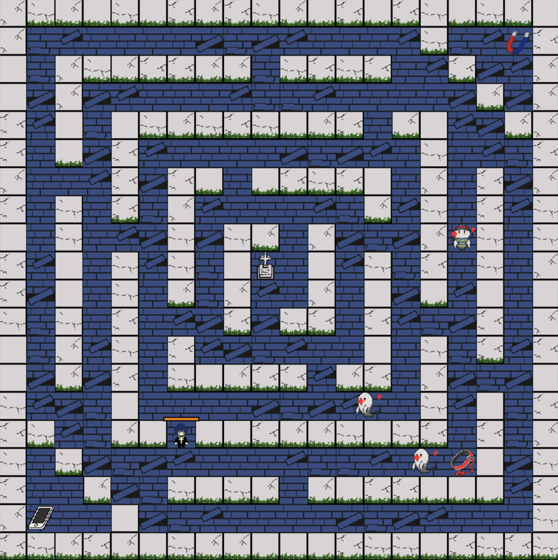
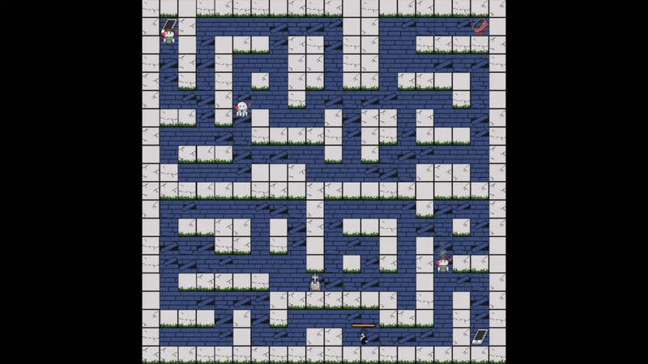

# ConSoul


**ConSoul** は，墓地をさまよう幽霊から逃げながら，散らばった故人たちの思い出の品を回収し，それぞれの墓へ返していく2Dアクションゲームである．

プレイヤーはダッシュを使って幽霊をかわしながら墓地をかけ回り，すべての遺品を元の場所へ戻すことを目指す．ゲーム全体のテンポは比較的速く，敵の動きを瞬間的に判断しながら移動ルートを選択することも重要となってくる．

## デモ

[ブラウザでプレイ](https://shihu-14.github.io/ConSoul/)

## 工夫点

### Push操作



（GIF が表示されない場合は [こちら](docs/movie/consoul_push_1.mp4)）

墓地にある墓石は，Push操作によって動かすことができる．
Push操作は，追い込まれた状況を切り抜けたり，攻略を有利にしたりするための操作として取り入れた．

Push操作で墓石を動かすことで，回収するアイテムまでの近道を作ったり，追ってくる敵との間に障害物を作ったり，逃げるための経路をその場で変更できる．また，幽霊を特定の場所へ誘導し墓石で囲って閉じ込めるという敵への対抗手段としても使える．



（GIF が表示されない場合は [こちら](docs/movie/consoul_push_2.mp4)）

### 敵の特徴

敵には複数の行動パターンがあり，それらの敵を攻略する上でPush操作と相性が良いように設計した．

プレイヤーを追い続ける敵はやられてしまうリスクとなる一方，プレイヤーについてくる性質を利用することで，意図した場所へ誘導して墓石の中へ閉じ込めることができる．ステージによっては追跡してくる敵が複数存在し，そのうち1体を閉じ込めて行動範囲を制限することで攻略を有利に進められる．

直線的に突進する敵は開けた通路では特にリスクがあるが，Push操作で墓石の配置を変え，入り組んだ地形を作ることで，その敵の強みを抑えることができる．

## ファイル構成

```text
src/
  main.ts            入力・更新・描画の接続
  game/              ステージ、プレイヤー、敵、ブロックのゲームロジック
  renderer/          Canvas による画面描画
  audio/             BGM と効果音
  assets/images/     ゲーム用の画像
  assets/audio/      ゲーム用の音声
docs/teaser.png      README 用のティーザー画像
index.html           ブラウザの入口
```

## 実行方法

```bash
npm install
npm run dev
```
