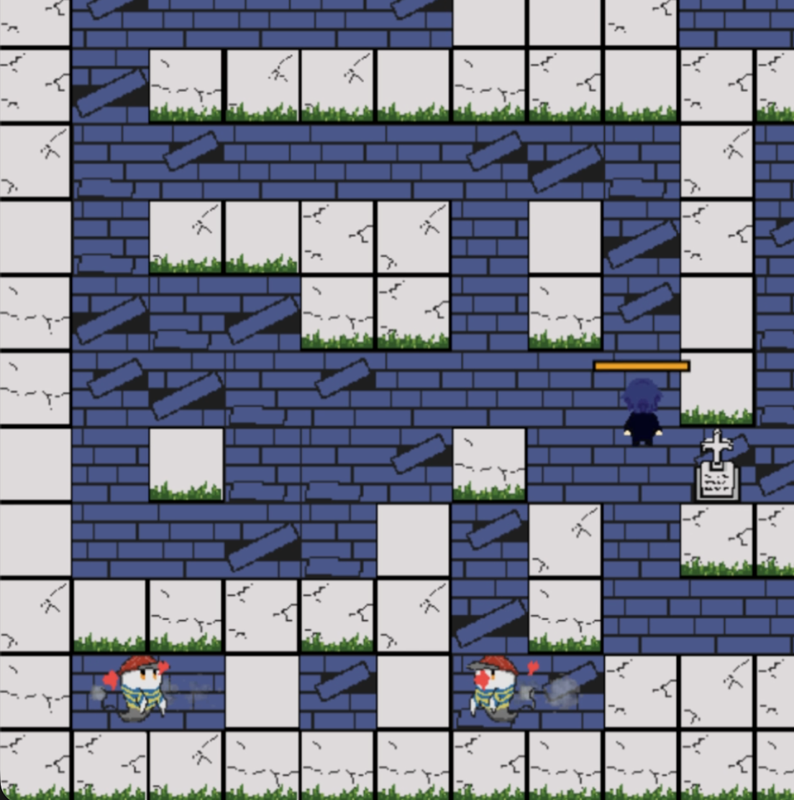

# ConSoul


**ConSoul** は，墓地をさまよう幽霊から逃げながら，散らばった故人たちの思い出の品を回収し，それぞれの墓へ返していく2Dアクションゲームである．

プレイヤーはダッシュを使って幽霊をかわしながら墓地をかけ回り，すべての遺品を元の場所へ戻すことを目指す．ゲーム全体のテンポは比較的早く，敵の動きを瞬間的に判断しながら移動ルートを選択することも重要となってくる．

### ダッシュを中心とした高速な駆け引き

ゲームの中心となるのは，幽霊に追われながら素早く墓地を移動するアクションである．

敵との距離や進行方向を見ながらダッシュを使い，安全なルートへ逃げるか，目的のアイテムへ最短距離で向かうかを瞬間的に判断する必要がある．

敵ごとに移動パターンが異なるため，同じ移動操作でも相手によって立ち回り方が変化する．


（GIF が表示されない場合は [こちら](docs/movie/consoul_push_1.mp4)）

### 状況を変える補助操作としてのPush

墓地にある墓石は，Pushによって動かすことができる．



Pushは常に使うメイン操作ではなく，追い込まれた状況を切り抜けたり，攻略を有利にしたりするための補助的な操作として設計している．

墓石を動かすことで，

- アイテムまでの近道を作る
- 追ってくる幽霊との間に障害物を作る
- 逃走経路をその場で変更する
- 幽霊を特定の場所へ誘導し，墓石で囲って閉じ込める

といった使い方ができる．

一方で，Pushしている間には隙が生まれるため，敵に追われている状況で不用意に使用すると危険になる．いつ通常の移動やダッシュを続け，いつPushによって状況そのものを変えるかという判断が重要となる．

### 敵の特徴を利用した攻略

敵には複数の行動パターンがあり，それぞれ異なる駆け引きが生まれるようにしている．

プレイヤーを追い続ける幽霊は常に大きな脅威となる一方，プレイヤーについてくる性質を利用することで，意図した場所へ誘導して墓石の中へ閉じ込めることができる．ステージによっては追跡型の敵が複数存在し，一体を閉じ込めて行動範囲を制限することが攻略上重要になる．

ランダムに移動する幽霊は行動を完全には予測できず，追跡型の敵を誘導している最中にも予定外の方向から現れることで，計画を崩す存在となる．

決まったルートを巡回する幽霊は動きを予測できるため，巡回のタイミングを読み，その隙を利用して突破することができる．

直線的に突進する幽霊は開けた場所では特に危険だが，Pushで墓石の配置を変えて入り組んだ地形を作ることで，その強みを抑えることができる．

このように，高速な移動とダッシュによる瞬間的な判断をゲームの中心に置きつつ，Pushによって地形や敵との関係を一時的に変えられることを，ゲームの駆け引きとして重視している．


（GIF が表示されない場合は [こちら](docs/movie/consoul_push_2.mp4)）

## デモ

[ブラウザでプレイ（GitHub Pages）](https://shihu-14.github.io/ConSoul/)

## ファイル構成

```text
src/
  main.ts            入力・更新・描画の接続
  game/              ステージ、プレイヤー、敵、ブロックのゲームロジック
  renderer/          Canvas による画面描画
  audio/             BGM と効果音
  assets/images/     ゲーム用の画像
  assets/audio/      ゲーム用の音声
docs/teaser.png      README 用のティーザー画像
index.html           ブラウザの入口
```

## 実行方法

Node.js 20 系なら 20.19 以降、または 22.12 以降を使用してください。

```bash
npm install
npm run dev
```
