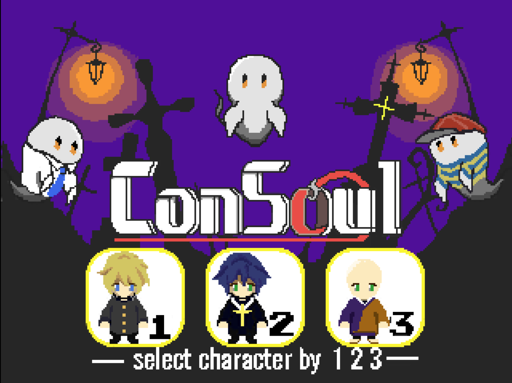

# ConSoul



## どんなゲーム？

ConSoul は、敵を避けながら迷路のアイテムを回収し、納品場所まで運ぶブラウザゲームです。3 人のキャラクターから 1 人を選び、ブロックを押して道を作ったり、ダッシュで敵を振り切ったりしながらステージを進めます。操作方法はゲーム画面の右側に表示されます。

## デモ

[ブラウザでプレイ（GitHub Pages）](https://shihu-14.github.io/ConSoul/)

## ファイル構成

```text
src/
  main.ts            入力・更新・描画の接続
  game/              ステージ、プレイヤー、敵、ブロックのゲームロジック
  renderer/          Canvas による画面描画
  audio/             BGM と効果音
  assets/images/     ゲーム用の画像
  assets/audio/      ゲーム用の音声
docs/teaser.png      README 用のティーザー画像
index.html           ブラウザの入口
```

## 実行方法

Node.js 20 系なら 20.19 以降、または 22.12 以降を使用してください。

```bash
npm install
npm run dev
```
